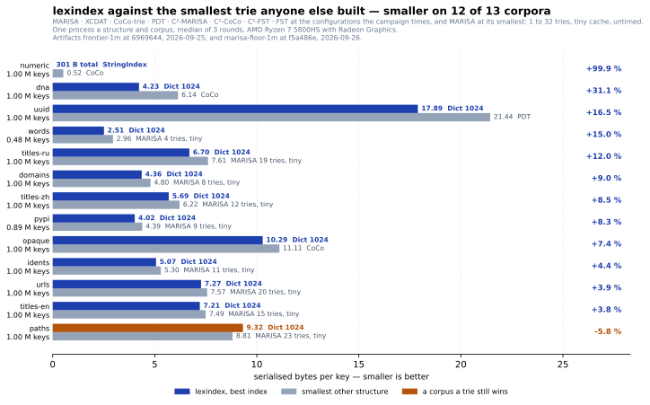

# lexindex

**Compact, immutable string↔id indexes for huge catalogs** — a Rust core built on
[`fst`](https://crates.io/crates/fst) (finite-state transducer) and an in-crate minimal perfect hash,
with typed Python bindings and no Python runtime dependencies.

Build once over a set of strings (entity names, cluster labels, vocabulary terms, document keys),
then query many times: exact `string ↔ id` both ways, plus **prefix**, **range**, **fuzzy**
(Levenshtein) and **subsequence** iteration — all automaton-driven over the FST (exact, prefix and
range seek directly; a broad fuzzy or subsequence pattern may still traverse most of the automaton).
The blobs are tiny — on real dictionary words, **`CompactHashIndex` reaches 1.24 bytes/key, 2.4× below
`marisa-trie`**, and `StringIndex` 5.95 — and all but `ClosedHashIndex` can be **memory-mapped and
borrowed** rather than read, `DictIndex` materialising only its per-block samples and a few
tables, so a multi-gigabyte index is ready instantly and its pages are shared across processes.

[](benchmarks.md#the-research-frontier-measured)

<sub>Thirteen corpora at a million keys against MARISA, XCDAT, CoCo-trie, PDT and the C² benchmark's
structures, each at its own best configuration — the protocol, the ten-million-key table and every
other structure are in [the benchmarks](benchmarks.md#the-research-frontier-measured). The figure is
the size axis, which `DictIndex` wins. On an exact lookup XCDAT is still ahead on most corpora at a
million keys: lexindex's faster exact search there — `DictIndex` after 4.4's opt-in
`route_microblocks()`, which holds 0.25–0.5 bytes a key more in memory, or `StringIndex` — beats
XCDAT 15 on `dna`, trails it by 6–11 % on `uuid`, `urls` and `titles-ru` and by 1.2× to 1.9× on the
other nine. At ten million keys it is ahead on `dna`, `numeric` and `urls`, level on `titles-en` and
`uuid`, and 1.36× behind on `opaque`. **`HashedDictIndex` (4.1) wins the latency axis outright:**
the same dictionary with its `id` answered by a perfect hash is 4.1× to 9.0× faster than XCDAT 15
and 1.4× to 3.2× smaller, on all thirteen corpora at a million keys and all six at ten million — and
3.1× to 7.4× faster and 1.2× to 2.8× smaller with an 8-bit fingerprint that turns away all but one
stranger in 256; an exact answer for a stranger is the dictionary's search above. Every column is in
[the benchmarks](benchmarks.md#hasheddictindex-against-xcdat), and none is quoted here without the
others.</sub>

```bash
pip install lexindex
```

```python
import lexindex

idx = lexindex.StringIndex(["apple", "apricot", "banana"])
idx.id("banana")          # 2   — string → id (sorted rank)
idx.key(0)                # "apple"  — id → string
idx.prefix("ap")          # [("apple", 0), ("apricot", 1)]
idx.fuzzy("aple", 1)      # [("apple", 0)]  — typo-tolerant

idx.save("catalog.bix")
idx = lexindex.StringIndex.load_mmap("catalog.bix")   # zero-copy: no read into RAM
```

## Six indexes

- **`StringIndex`** — an **ordered** index backed by a finite-state transducer. Exact `string ↔ id`
  plus prefix / range / fuzzy / subsequence iteration. The only one that answers typo-tolerant
  queries. Use it for autocomplete, fuzzy search, ordered browse, dictionary segmentation. For an
  exact `string ↔ id` and nothing else, `HashedDictIndex` is faster and `DictIndex` smaller.
- **`DictIndex`** — an **ordered** dictionary with the key stored for every id: exact `string ↔ rank`
  both ways, `lower_bound`, `prefix`, `range`, in-order iteration, no automata so no fuzzy. The
  sorted keys are front-coded in blocks, the suffixes coded per shard under a symbol table or a
  packed alphabet, over a phrase dictionary mined from the whole blob:
  2.64 bytes/key, 56 % below `StringIndex`. Use it where the queries are exact and every id has
  to map back to its key.
- **`HashedDictIndex`** — a `DictIndex` with a hash sidecar: the dictionary's ranks and ordered
  queries, with `id` answered by a minimal perfect hash and a table of ranks instead of a search.
  2.62 bytes/key on top of the dictionary, one more per eight fingerprint bits for `id` to reject a
  non-member at `2^-bits`; at zero bits `id` is the dictionary's exact search and `id_unchecked`
  the closed-vocabulary path — 4.1–9.0× faster than XCDAT, the fastest trie measured, at 1.4–3.2×
  less space. Use it where a `DictIndex` is wanted and `id` is the hot path.
- **`CompactHashIndex`** — the **smallest** `string → dense id` map that can reject a non-member (a
  minimal perfect hash plus a fingerprint per key, no keys stored). 1.24 bytes/key, at the cost of
  probabilistic membership and no reverse lookup.
  Use it when a fixed vocabulary's footprint is paramount.
- **`ClosedHashIndex`** — the perfect hash **and nothing else**: `id(key) -> u32`, no `Option`, for
  a vocabulary known to be closed. A member's id, and for anything else some id in `[0, n)`.
  0.24 bytes/key, a fifth of `CompactHashIndex`. Use it as a token → id map where every query is a
  member by construction.
- **`PerfectHashIndex`** — a **minimal-perfect-hash** dictionary with verified membership and reverse
  lookup; exact `string → dense id`, and `id_unchecked` is the fastest lookup here for a vocabulary
  known to be closed. Use it as a fixed-vocabulary token↔id map on a hot path when you need exact
  membership and `id → key`. Built with `fingerprints=True`, one more byte per key lets a lookup of an
  absent key stop after one cache miss instead of two.

All six assign dense ids in `[0, n)` and serialise to a flat, relocatable blob
(`save` / `load`, and `load_mmap` where there is more than the perfect hash to map). None is mutable after building — they are immutable summaries, like
the clustering features in the companion [`betula-cluster`](https://github.com/ilgrad/betula-cluster)
crate.

## What's here

- **[Usage guide](usage.md)** — every interface with runnable Python, Rust and C snippets.
- **[Design](design.md)** — how the FST rank-walk, the fingerprint and minimal-perfect-hash
  dictionaries, and zero-copy memory-mapping work, and the serialised blob layout.
- **[API reference](api.md)** — the typed public surface.
- **[Upgrading to 4.0](migration-4.md)** — which 3.x blobs still load, which have to be
  rebuilt, how to get the keys back out of one, and whose ids survive the rebuild.
- **[Changelog](changelog.md)**.
- **[Sponsor](https://github.com/sponsors/ilgrad)** — if lexindex saves memory or latency in a system
  you run; corporate sponsorship funds compatibility, benchmarking, security hardening and
  large-scale performance work.
